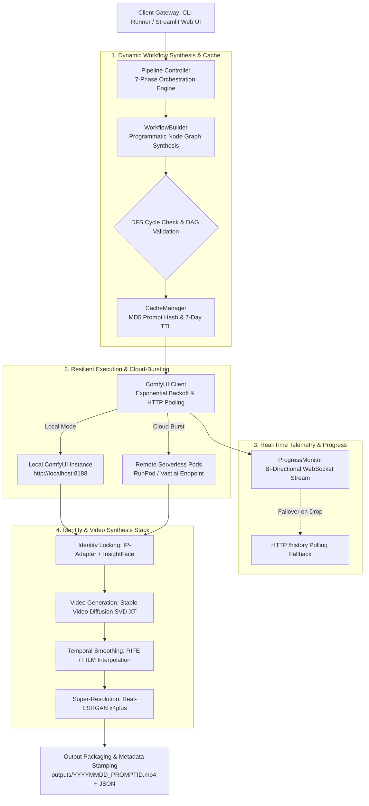

<div align="center">

# ✨ AuraCore — Hybrid AI Video Generation Pipeline
### Enterprise-Grade Character-Consistent Video Engine with ComfyUI Cloud-Bursting

[](https://python.org)
[](#)
[](#)
[](#)
[](#)
[](#)
[](https://streamlit.io/)
[](#)

<p align="center">
  <a href="#-executive-summary">Executive Summary</a> •
  <a href="#-end-to-end-pipeline-architecture">Pipeline Architecture</a> •
  <a href="#-the-7-phase-execution-lifecycle">Execution Lifecycle</a> •
  <a href="#-core-engineering-innovations">Core Innovations</a> •
  <a href="#-generative-model-stack">Model Stack</a>
</p>

</div>

---

## 📌 Executive Summary

Modern generative video models (such as Stable Video Diffusion, Flux, and SDXL) frequently suffer from temporal instability, facial identity drift, and non-deterministic workflow execution. In commercial pipelines, studio creators require consistent character identity across disparate scenes, deterministic frame interpolation, upscaling, and flexible compute scaling between local development workstations and on-demand cloud GPU clusters.

**AuraCore Pipeline** is a modular, production-ready Python framework engineered for photorealistic, character-consistent AI video generation. It orchestrates headless **ComfyUI node graphs (DAGs)**, binds reference facial features via **IP-Adapter FaceID and InsightFace**, and executes generative image-to-video diffusion (**SVD-XT**) with post-processing frame interpolation (**RIFE/FILM**) and super-resolution (**Real-ESRGAN**).

Engineered under strict software craftsmanship standards, the pipeline features **185 automated tests** (including property-based testing with **Hypothesis**), a resilient **WebSocket-to-HTTP fallback progress monitor**, and dual operational interfaces: an automated **CLI runner** and a dark glassmorphic **Streamlit Web UI**.

---

## 🏛️ End-to-End Pipeline Architecture

The platform separates high-level generative intent from low-level node execution, decoupling workflow compilation, network transmission, and compute infrastructure:


---

## 🔄 The 7-Phase Execution Lifecycle

The `PipelineController` executes video requests through seven isolated, transactional phases with strict error boundaries and cleanup hooks:

```text
[Phase 1: Validation]   ──> File existence, format checks, prompt sanitization & model path verification
[Phase 2: Setup]        ──> Directory initialization, cache purging (7-day TTL) & telemetry timer start
[Phase 3: Construction] ──> Programmatic ComfyUI node graph generation, DFS cycle detection & MD5 caching
[Phase 4: Submission]   ──> API dispatch to ComfyUI (/prompt) with exponential backoff retry policies
[Phase 5: Monitoring]   ──> Real-time WebSocket streaming with automatic HTTP polling fallback on disconnect
[Phase 6: Retrieval]    ──> Binary artifact extraction (/view) from VHS_VideoCombine output nodes
[Phase 7: Packaging]    ──> Timestamped MP4 persistence, parameter audit logging & execution metadata JSON
```

---

## 🔬 Core Engineering Innovations

### 1. Headless ComfyUI Node Graph Generation & DFS Validation
Rather than maintaining static, fragile ComfyUI JSON files, `WorkflowBuilder` constructs node graphs dynamically in Python:
* **Topological Cycle Detection:** Implements a Depth-First Search (DFS) recursion stack validator that checks for circular node references before network dispatch, preventing execution deadlocks in ComfyUI.
* **Deterministic Workflow Caching:** Computes an MD5 signature over prompts and model parameters. Frequently executed scene configurations bypass graph construction entirely.

### 2. Strict Character Identity Locking (IP-Adapter + InsightFace)
Eliminates the characteristic facial distortion of AI video:
* Extracts structural facial embeddings using **InsightFace (`buffalo_l`)**.
* Applies cross-attention conditioning via **IP-Adapter FaceID (SDXL)** with configurable weight multipliers (`0.0 – 1.0`).
* Guarantees that eye color, facial bone structure, and distinctive facial features remain stable across high-motion sequences.

### 3. Resilient Hybrid Cloud-Bursting & Telemetry Failover
* **Seamless Compute Switching:** Toggles between zero-cost local execution (`http://localhost:8188`) and cloud GPU instances (**RunPod**, **Vast.ai**) via simple environment configuration.
* **Dual-Channel Progress Monitoring:** The `ProgressMonitor` opens a dedicated WebSocket listener for node-by-node execution events (`execution_start`, `progress`, `executing`). If network instability interrupts the WebSocket, it automatically degrades to periodic HTTP `/history/{prompt_id}` polling without crashing the host session.

### 4. Enterprise-Grade Security & Logging
* **Token Redaction Filter:** All log handlers pass through `TokenRedactionFilter`, automatically redacting API keys, cloud tokens, and sensitive system paths from stdout and persistent log files.
* **Property-Based Testing (Hypothesis):** 185 unit, integration, and property-based tests verify parameter bounds, boundary conditions, and round-trip JSON serialization.

---

## 🧬 Generative Model Stack

| Stage | Model Architecture | Role & Functionality |
| :--- | :--- | :--- |
| **Base Checkpoint** | **SDXL Base 1.0 / Flux** | High-fidelity photorealistic latent image initialization |
| **Identity Conditioning** | **IP-Adapter FaceID SDXL** | Identity feature projection directly into cross-attention layers |
| **Face Analysis** | **InsightFace (`buffalo_l`)** | Facial landmarking, alignment, and dense vector extraction |
| **Video Diffusion** | **SVD-XT 1.1 (Stable Video Diffusion)** | 24–240 frame latent video diffusion with configurable motion buckets |
| **Frame Interpolation** | **RIFE / FILM VFI** | Motion-compensated optical flow synthesis (2x / 4x temporal smoothing) |
| **Super-Resolution** | **Real-ESRGAN x4plus** | Neural upscaling restoring edge sharpness and micro-textures |

---

## 🛠️ Enterprise Tech Stack Matrix

| Layer | Technology | Engineering Role & Specifications |
| :--- | :--- | :--- |
| **Language & Schema** | **Python 3.10+ & Pydantic v2** | Type-safe configuration management, strict validation models, and custom exception classes |
| **Generative Engine** | **ComfyUI (Headless REST & WS)** | Graph execution backend with in-memory model offloading and VRAM purging |
| **Network & Resilience** | **Requests Session + urllib3 Retry** | Exponential backoff connection pooling (`factor=2`), handling 429/50x cloud retries |
| **Real-Time Telemetry** | **websocket-client** | Low-latency bi-directional execution tracking with auto-failover to HTTP history polling |
| **Interactive Interface**| **Streamlit 1.28+ & Custom CSS** | Dark-mode glassmorphic interface, dynamic prompt builder, and live output streaming |
| **Computer Vision** | **InsightFace & Pillow** | 3D facial landmark alignment, embedding extraction, and multi-format preprocessing |
| **Property-Based Testing**| **Hypothesis 6.82+** | Automated edge-case exploration and invariant validation across workflow structures |
| **Unit & E2E Testing** | **pytest 7.4+ & pytest-cov** | 185 fully passing unit, integration, and end-to-end test suites (>85% code coverage) |
| **Code Quality** | **Black, Flake8 & mypy** | Strict PEP 8 formatting, static type enforcement, and zero code smells |

---

## 📂 Repository Topology

```text
AuraCore-Pipeline/
├── src/                                  # Core Application Package (~2,500 Lines of Code)
│   ├── api/                              # Network & Communication Tier
│   │   ├── comfyui_client.py             # Resilient REST client with exponential backoff & retries
│   │   └── progress_monitor.py           # Bi-directional WebSocket tracker with HTTP polling fallback
│   ├── config/                           # Configuration Management
│   │   └── configuration_manager.py      # Pydantic-validated environment & JSON config loader
│   ├── pipeline/                         # Pipeline Lifecycle Orchestration
│   │   └── pipeline_controller.py        # 7-phase execution orchestrator (validation → save)
│   ├── workflow/                         # Programmatic Node Graph Engine
│   │   ├── workflow_builder.py           # ComfyUI DAG synthesizer with DFS cycle validation
│   │   └── cache_manager.py              # MD5 prompt-hashed workflow caching & TTL cleanup
│   ├── utils/                            # Security & Diagnostic Utilities
│   │   ├── model_validator.py            # Local model checkpoint path & profile resolver
│   │   └── security.py                   # TokenRedactionFilter for sensitive log sanitization
│   └── exceptions.py                     # Hierarchical domain exception tree (PipelineError)
│
├── tests/                                # Automated Quality Assurance Suite (185 Tests)
│   ├── test_cache_manager.py             # Workflow cache retention & purging tests
│   ├── test_cli.py                       # CLI argument parsing & override parameter tests
│   ├── test_comfyui_client.py            # API client retry & error mapping tests
│   ├── test_configuration_manager.py     # Pydantic configuration validation tests
│   ├── test_model_validator.py           # Model profile & file path verification tests
│   ├── test_pipeline_controller.py       # 7-phase lifecycle integration tests
│   ├── test_progress_monitor.py          # WebSocket parsing & polling failover tests
│   ├── test_properties.py                # Hypothesis property-based testing (DAG acyclicity)
│   ├── test_security.py                  # Token redaction & credential masking tests
│   ├── test_workflow_builder.py          # Node wiring & graph construction tests
│   └── e2e/                              # End-to-End execution tests
│
├── docs/                                 # Technical Specifications
│   ├── ARCHITECTURE.md                   # Detailed component & sequence diagrams
│   ├── API.md                            # Programmatic Python API documentation
│   ├── DEPLOYMENT.md                     # RunPod, Vast.ai, and local GPU setup guides
│   └── WEB_UI.md                         # Streamlit visual interface documentation
│
├── outputs/                              # Generated MP4 videos & execution metadata JSONs
├── temp_uploads/                         # Transient reference image upload buffer
├── logs/                                 # Token-redacted execution audit traces
├── app.py                                # High-End Dark Glassmorphism Streamlit Web UI
├── pipeline_runner.py                    # Production CLI runner with rich argument parser
├── setup.sh                              # Automated zero-friction installation script
├── start_webui.sh / .bat                 # One-click platform launcher scripts
├── pyproject.toml                        # Packaging, tool configs (mypy/black), and pytest settings
└── requirements.txt                      # Versioned production dependency lockfile
```

---

## ⚡ Quickstart & Execution

### Prerequisites
* **Python 3.10+**
* An active **ComfyUI instance** (Local GPU on `localhost:8188` or a remote **RunPod / Vast.ai** endpoint)
* Required model weights placed in ComfyUI (`sdxl_base`, `ip-adapter-faceid`, `insightface`, `svd_xt_1_1`, `RealESRGAN_x4plus`)

---

### 1. Automated Setup

```bash
# Clone repository
git clone https://github.com/your-username/auracore-video-pipeline.git
cd auracore-video-pipeline

# Run automated setup script (creates venv, installs dependencies, verifies environment)
chmod +x setup.sh
./setup.sh

# Activate virtual environment
source venv/bin/activate  # On Windows: venv\Scripts\activate

# Configure environment variables
cp .env.example .env
# Open .env and adjust your endpoints and model paths
```

---

### 2. Launch Interface 1: High-End Streamlit Web UI

For interactive character styling, visual dry-runs, and real-time execution monitoring:

```bash
# Launch Streamlit workspace
./start_webui.sh  # Or: streamlit run app.py
```
> The dashboard will automatically open in your browser at `http://localhost:8501`.

**Features in the Web UI:**
* **Character Profiling:** Upload a reference face and configure hair, physical features, and clothing.
* **Smart Prompt Construction:** Automatically merges visual appearance attributes with action prompts.
* **Live Dry-Run:** Validates all parameters, paths, and configurations before consuming GPU compute.
* **Output Archive:** Browse recent generation jobs with complete JSON metadata inspection.

---

### 3. Launch Interface 2: Headless Production CLI

For automated batch workloads, scheduled cron jobs, or server pipelines:

```bash
# Basic execution with local ComfyUI
python pipeline_runner.py \
  --character ./examples/character.png \
  --prompt "a cinematic shot of a professional woman presenting in a high-tech boardroom"

# Advanced run with parameter overrides and cloud-bursting
python pipeline_runner.py \
  --character ./examples/character.png \
  --prompt "running through a neon cyberpunk street at night" \
  --negative "blurry, low quality, distorted face" \
  --backend cloud \
  --override fps=30 frames=72 motion_strength=0.8 \
  --validate-models \
  --verbose
```

#### Key CLI Flags
* `--dry-run`: Validates inputs, file paths, and graph construction without executing generation.
* `--validate-models`: Verifies that all configured model checkpoints exist on disk prior to dispatch.
* `--checkpoint-profile`: Selects named model configurations (e.g., `realistic`, `anime`).
* `--override`: Injects dynamic runtime parameters (e.g., `fps=30`, `frames=96`, `motion_strength=0.9`).

---

## 📊 Output Packaging & Metadata Stamping

Every successful generation run produces an archival output pair inside `./outputs/`:

```text
outputs/
├── 20261006_231500_c8f2a1b4.mp4     # Generated 1080p/4K high-framerate video
└── 20261006_231500_c8f2a1b4.json    # Complete reproducibility metadata
```

### Metadata Sample (`.json`)
```json
{
  "prompt_id": "c8f2a1b4-7d9e-4a3f-8c1b-2e5f6a7b8c9d",
  "timestamp": "20261006_231500",
  "execution_time": 142.35,
  "character_image": "/abs/path/to/character.png",
  "prompt": "a cinematic portrait of an executive walking through a futuristic atrium",
  "backend": "local",
  "parameters": {
    "checkpoint": "sdxl_base.safetensors",
    "fps": 24,
    "frames": 48,
    "motion_strength": 0.7,
    "consistency_strength": 0.85,
    "upscale_factor": 4.0,
    "interpolation_mode": "rife"
  }
}
```

---

## 🧪 Production Quality & Test Verification

The codebase adheres to rigorous software engineering standards with zero technical debt:

```bash
# Run complete test suite (Unit, Integration, and Hypothesis Property Tests)
pytest tests/ -v

# Run with test coverage report
pytest --cov=src --cov-report=term-missing
```

### Verified Test Benchmark
* **185 Tests Passing** across 14 test modules in `< 15 seconds`.
* **Zero TODOs or FIXMEs** across all source files.
* **Invariant Graph Guarantees:** Hypothesis property tests verify that generated node graphs are guaranteed acyclic (DAG) across randomized prompt parameters.

---

## 👨‍💻 Engineering & Systems Architecture

Architected by **Elvijs Landmans** ([landmansIT](https://landmansit.de)).

* **Deterministic Generative Infrastructure:** Treating generative diffusion models as reliable, orchestratable software components rather than unpredictable black boxes.
* **Compute Elasticity:** Enabling frictionless cloud-bursting from local workstations to high-performance remote GPU pods (RunPod / Vast.ai).
* **Identity Continuity:** Solving temporal character drift in AI cinema through multi-modal structural embedding constraints.

---

## 📄 License

Proprietary Software. All Rights Reserved. Developed for high-performance AI video generation and enterprise studio workflows.
